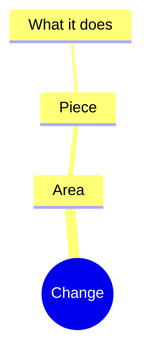

## What changed

<!-- One line. Same rule as the commit subject: English imperative, no period. -->

## The problem

<!--
What was broken, missing or wrong BEFORE this PR. Be concrete: the symptom, who
hit it, what it cost. "There was no X" is a problem; "add X" is not.
If this is not a fix, say what gap motivated the work.
-->

## Why this solution

<!--
Plain human language — a teammate who has never opened this code should
understand what now happens differently. No diff narration, no file lists.
Alternatives considered and why they lost, one line each.
-->

## Screenshots

<!--
REQUIRED when the change adds or alters a screen. One image per screen, dragged
into the PR body. Show the states a reviewer cannot guess: empty, error, mobile.
Otherwise write "N/A — no visual change".
-->

## Architecture

<!--
REQUIRED when the change touches structure: new module, new dependency, new data
flow, new boundary, new deployment surface. Otherwise write "N/A — no structural
change" and delete the diagram.
-->



## Decisions

<!--
One row per non-obvious call (a trade-off, a dependency, a convention, a schema
shape). "Approved by" is the human who said yes — never the agent that proposed
it, and never left blank at merge time.
-->

| Decision | Proposed by | Approved by |
|---|---|---|
|  |  |  |

## Labels

<!-- Definitions: .github/labels.yml · path mapping: .github/labeler.yml -->

- type: `type:`
- areas: `area:`

### Risk — tick what applies and add the label

- [ ] `db-migration` — touches the schema or needs SQL in production
  - SQL to run (**additive**, never `migrate dev`):
    ```sql
    -- paste here
    ```
- [ ] `needs-env-var` — new variable: <!-- VAR_NAME --> (declare it in the env
      schema and load it in the host before merging)
- [ ] `needs-followup-pr` — not complete on its own; missing: <!-- link or description -->
- [ ] `depends-on-pr` — do not merge before: <!-- owner/repo#123 -->
- [ ] `breaking-change` — breaks a public API, a contract or data. Compatibility plan:
- [ ] None of the above: self-contained, can be merged and deployed on its own.

## Checklist

- [ ] Labeled: one `type:*` + every matching `area:*` + risk
- [ ] Problem and solution in human language, not diff narration
- [ ] Mind map included, or explicitly marked N/A
- [ ] Screenshots for every screen touched, or explicitly marked N/A
- [ ] Every decision has a proposer and a human approver
- [ ] `./scripts/check-filenames.sh && ./scripts/check-api-docs.sh && ./scripts/check-secrets.sh`
- [ ] Lint and build pass
- [ ] New API route ships its `route.md` beside it
- [ ] Functional change to published code → SemVer bump + `CHANGELOG.md` entry
