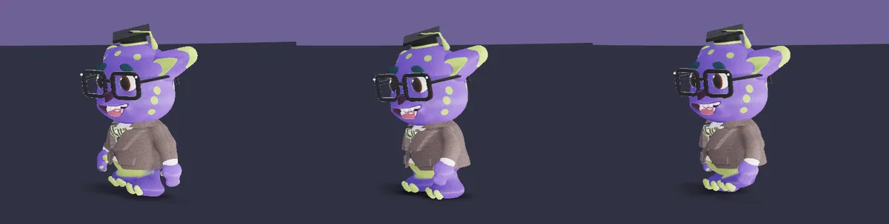

# Case study: Finn

Finn is the mascot of [Emihs](https://emihs.co), an education platform for
children aged 4–12 and their teachers. He walks across the landing page's
footer, stops halfway to turn and wave hola, walks on, rests, and comes back.
The cursor is his key light and his gaze target.

This skill was distilled from building him. Finn's code lives in a private
repository, so it is not published here. This page is the record of what was
built, how it scored and what each iteration fixed, with the key fragments
inlined.

## From reference to the page

Three stages, same character: what the brand handed over, what the shader
renders headless, and Finn live on the landing page.

**1. The original render.** The brand's turnaround, and the only thing the
fidelity judge scores against:


**2. The SDF render.** The same five views from `render-harness.mjs` pointed
at Finn's shader, then one gait cycle and the wave. No browser, vgpu on Node:


**3. The animation as it shipped.** The footer of the Emihs landing, in a
real browser on WebGPU, captured with `agent-browser`:




### How those captures were taken

Stages 1 and 3 came from
[`agent-browser`](https://github.com/vercel-labs/agent-browser), so they can
be retaken after any change and dropped into the PR as before/after.

```bash
# 1. the original render: a throwaway page holding the turnaround, one shot
agent-browser --session ref --allow-file-access batch \
  "set viewport 1800 332 1" "open file://$PWD/ref.html" "wait 800" "screenshot ref.png"

# 3. the live animation: headed, WebGPU on
agent-browser --session finn --headed --args "--enable-unsafe-webgpu" batch \
  "set viewport 1440 900 1" "open http://localhost:3000" "wait 1500"
agent-browser --session finn eval 'window.scrollTo(0, document.body.scrollHeight)'
for i in $(seq -w 1 60); do agent-browser --session finn screenshot "b_$i.png"; done

# crop the footer band and loop it
ffmpeg -pattern_type glob -i 'b_*.png' -vf "crop=1440:330:0:570,scale=960:-1" c_%02d.png
img2webp -loop 0 -d 240 -lossy -q 70 c_*.png -o finn-live-walk.webp
```

Before trusting a capture, ask the page whether WebGPU is actually up.
Without it the stage renders nothing, which is the correct behaviour and an
empty screenshot:

```bash
agent-browser --session finn eval '(async () => !!(await navigator.gpu?.requestAdapter()))()'
```

Two things that cost time:

- **`agent-browser record` does not work here.** It records in a fresh
  context that comes up without WebGPU, so Finn is missing from the video. A
  burst of screenshots from the headed session works: 60 frames take about
  14 s, close to real time at 4 fps.
- **Close-ups need the canvas rect at the moment of the shot.** Finn covers
  about 50 px a second, so read the canvas's `getBoundingClientRect()` right
  before each screenshot and crop around it, at a 2× viewport scale.

## What he is made of

| File | Lines | Holds |
|---|---|---|
| `finn-walker-shader.ts` | ~860 | the SDF, 19 materials, fur, tweed, lighting, camera, all in one WGSL pass |
| `finn-walker-motion.ts` | ~560 | the pure sim: gait, arm chains, torso, turns, the wave state machine, secondary motion |
| `finn-walker-motion.check.mjs` | ~30 | the runnable check |
| `FinnWalker.tsx` | ~170 | the vgpu client, a11y toggle, visibility, DPR drop |

The brief asked explicitly for web technology and vgpu, not a mesh and not
Blender. The raymarch costs about 12 ms per frame at 2× DPR on an Apple M4,
which is why the one-shot drop to 1× exists.

## Shape: 84.7 / 100

A fidelity judge scored renders against the brand's turnaround (front, back,
both profiles, three-quarters, top). It plateaued at 84.7, and the team
accepted that ceiling.

What carried the score:

- **Every proportion measured from the sheet.** Even the 17 polka dots on the
  head are unit directions from the head centre, read off the front, back and
  profile views.
- **Clothing as shells of the body.** The jacket and shirt are offset shells
  of the torso field, and the upper sleeve is the arm capsule itself, blended
  into the jacket so the shoulder is one piece of cloth:

  ```wgsl
  let j = jacket(r, t);                 // t: the torso's own distance
  var jx = j.x;
  let aL = arm(ra, 1.0);
  let aR = arm(ra, -1.0);
  // only the upper sleeve blends into the shoulder; the forearm stays a separate tube
  if (j.y == M_JACKET) { jx = smin(jx, min(aL.z, aR.z), 0.03); }
  ```

- **A bounded head.** The head (eyes, glasses, teeth, tongue, brows, ears,
  cap, dots) is the most expensive part. The ray only evaluates it inside a
  cheap bounding sphere:

  ```wgsl
  let hb = length(hp - vec3f(0.0, 0.8, 0.0)) - 0.46;
  if (hb < res.x) { let h = head(hp); res = pick(res, h.x, h.y); }
  else { res = pick(res, hb + 0.02, M_FUR); }
  ```

- **Fur as displacement near the surface only** (`d - len * strands(q)` when
  `d < 0.04`), with strands at a ~2 px period at the browser's footprint.
  Finer than that only aliases into grain.
- **Soft shadows with short capped steps.** Long steps skipped the 12 mm
  jacket shell and traced contour bands across it.

## Motion: 38 → 86 / 100

An adversarial motion judge (a fresh subagent told to find what reads as
robotic) scored frame strips and joint curves from the harness. Each row is
one accepted round: its finding, the fix, and the measurement that proved it.

| Round | Judge's finding | Fix | Measured |
|---|---|---|---|
| 1 | Arms robotic: both swung through one filter, the elbow was a clipped sine, the wrist led the shoulder, arms froze at stops, the wave was a 7° metronome | Every joint became a damped spring, and each periodic target is **pre-compensated** by its joint's gain and lag. Palms turned toward the torso (forearm twist); the torso twists, leans, breathes and rolls. Turns became stepped instead of spun | shoulder lag at 1.8 Hz cadence was 124° before compensation |
| 2 | Feet skated and legs telescoped each step | The knee give shortened the legs; the hips now sink into the body instead, so legs keep their length. Arms hang closer, with an abduction floor from a probe | sleeve, not hand, binds first; floor 0.60 keeps both clear |
| 3 | The stance foot slid in turns | The body pivots around the planted ankle, computed from the shader's own leg angle; hips counter-rotate against the chest | slide was 2–3 px per turn |
| 4 | A lurch when the pivot foot changed | Weight blends between feet over double support; the pin stays on while the yaw settles | lurch was 70 px/s in one frame |
| 5 | Stopping jolted the upper body | Gait goals ease over ~80 ms before the spring sees them | twist jerk 1,900 → 28 |
| 6 | A human-sized elbow bend lifted his big hand level; arms stood out | Soft elbow, the hand hangs from the wrist, the forearm tucks toward the belly | hand ≥ 0.034 clear of the jacket |
| 7 | The wrist hooked like a puppet's paw; the arm led the opposite leg | The wrist only trails the forearm (~80° behind); the swing lags the leg by ~5% of a cycle | clearance 0.035 walking, 0.011 at worst coming down from the wave |

After round 7 the judge said what remained were rig limits: no knees, and no
cloth simulation. Tuning constants further would not move the score, so the
work stopped there.

### The two fragments that mattered most

The spring and its steady-state response. Every joint uses both:

```ts
function drive(s: Spring, target: number, k: number, zeta: number, dt: number, f = 0) {
  const a = (target - s.x) * k - s.v * 2 * zeta * Math.sqrt(k) + f;
  s.v += a * dt;
  s.x += s.v * dt;
  return a; // the next joint down the chain is pushed by this
}

function response(j: { k: number; z: number }, omega: number) {
  const r = omega / Math.sqrt(j.k);
  return { gain: 1 / Math.hypot(1 - r * r, 2 * j.z * r), lag: Math.atan2(2 * j.z * r, 1 - r * r) };
}
```

Finn's chain, stiffest to floppiest. The shoulder sits near its own pendulum
frequency on purpose, which is exactly why it needed compensation:

```ts
const J = {
  swing: { k: 70, z: 0.3 },  // ~1.3 Hz: a hanging arm's own pendulum
  abd: { k: 60, z: 0.5 },
  elbow: { k: 220, z: 0.4 },
  elbowF: { k: 380, z: 0.35 },
  wrist: { k: 160, z: 0.3 },
  flex: { k: 120, z: 0.3 },
  twist: { k: 110, z: 0.6 },
  curl: { k: 90, z: 0.5 },
};
```

The leg angle, shared by the shader and the sim so the planted foot never
moves. During stance, the ankle's horizontal offset moves linearly, like the
body:

```wgsl
fn legAngle(ph: f32) -> f32 {
  let u = fract((ph - 1.5708) / 6.28318);
  let s = select(-1.0 + 2.0 * smoothstep(0.0, 1.0, (u - 0.5) * 2.0), 1.0 - 4.0 * u, u < 0.5);
  return asin(sin(0.32) * s);
}
```

With a 0.1 ankle lever and a 0.32 rad swing, one cycle carries him
`4 · 0.1 · sin(0.32) ≈ 0.126` units. At 1.8 cycles per second that sets his
walking speed; any other speed and the feet slide.

## The check he ships with

It asserts what broke at least once:

```js
assert.deepEqual(modes.slice(0, 5), ["walk", "wave", "walk", "idle", "walk"]);
assert.ok(raised > 1.5, "the right arm actually rises to wave");
assert.ok(corr < 0, "walking, the arms swing opposite each other");
assert.ok(minGap > 0.01, "abduction keeps off the sleeve floor");
// plus: every param finite, x always on the stage
```

## Accessibility, from the gate that rejected him once

The first version failed an accessibility review. The toggle's changing label
contradicted its `aria-pressed`, the target was about 30 px, and Finn could
walk behind its transparent background. The fix, now in the template: the
label alone carries the state, the button is 44 px on an opaque pill, it
renders only once WebGPU is up, and `prefers-reduced-motion` starts him still.
